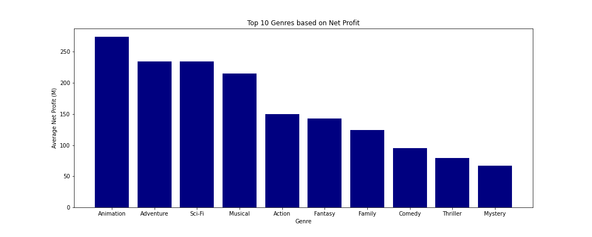

# Movie Analysis for Microsoft

**Authors**: Hyunwook Paul Shin, Derek Supino and Stephen William


## Overview

This is a project to provide Microsoft with a guide on what goes into creating and releasing a sucessfull movie based on data pulled from several reputable sources. Microsoft has launched its own movie studio but they don't know what tpye of film to release or even who to hire to help create a profitable film. The data was cleaned, organized and analysised to find out what the most sucessfull films of all time had in common with each other. With this information we can present the head of Microsoft's new movie studio what they can do to guarentee a sucessfull movie release.


## Business Problem

Micosoft's new film studio has just launched and they are trying to release a sucessfull movie but don't know where to start. With the data we collected and analysed we where able to come up with some questions that we thought where important to a sucessfull movie like "What months generate the most worldwide gross?", "What genres brings in the most profit?", and "What directors have brought in the biggest profits?". We believe these are the most important questions for a new film studio to ask because overall these are variables that can be closely connected to generating a profit.

We have 3 deliverables for the directors of the Microsoft Studio:
* Suggest which types of films are worth focusing on by establishing which genre makes the most profit.
* Analyze the monthly average return on investment rate for the suggested genre to determine which month has the best chance of earning profit.
* Evaluate how much do the top 50 directors contribute to the total profit to study the impact of the director on the movie production. 


## Data
We will use the data from the following sources:
* __[IMDB](https://www.imdb.com/)__
* __[The Numbers](https://www.the-numbers.com)__

IMDB: There are multiple dataset only including partial informations. The information we will need for the most is the genres and the staffs (directors, writers, actors, production) involved in movie production. 

The relevant dataset we will be using are the followings: 

* `imdb.name.basics.csv.gz`
* `imdb.title.akas.csv.gz`
* `imdb.title.basics.csv.gz`
* `imdb.title.principals.csv.gz`

The Number : This dataset includes the production budget and gross profit (both domestic and worldwide). The release date of the film is also included. The economic metrics will be used further to calculate the net profit and return on investment ratio (ROI).

The relevant dataset we will be using are the followings: 
* `tn.movie_budgets.csv.gz`

----Describe the data being used for this project.
Data was collected from the following websites:
    -https://datasets.imdbws.com/
    -https://www.kaggle.com/stefanoleone992/rotten-tomatoes-movies-and-critic-reviews-dataset?select=rotten_tomatoes_movies.csv
    


https://www.kaggle.com/stefanoleone992/imdb-extensive-dataset
https://www.imdb.com/interfaces/


## Methods


The several Imdb data sets where connected using movie and crew ID's to connect movie titles with their correct release date, budget, gross, crew members and genre's. Some data was missing so we further connected the movie titles and crew names with other data sets from Rotten Tomatoes and Numbers.com. With this method we can consolidate the data into just a few usefull tables that make it easier to analyse and cut out data that we don't find usefull. 


## Results
### Genres with Top Average Net Profit


### Monthly Average ROI over the year


### Impact of Top 50 Driector

--------Present your key results. For Phase 1, this will be findings from your descriptive analysis.

The results that we came up with based on our analytics is when is the best month to release a movie of a certain genre that typically brings in a large worldwide gross. We came to these rusults by finding the genres that produce the most profit and find the best performing months for those genres. So we can recomend to Microsoft that making an Animation movie will most likely generate a profit and to ensure that the movie will perform as best as it can we can also recomend that Microsoft release an Animated film in the month of June because based on historic data, Animated movies bring in the most Box Office Gross in the month of June. 

Another result that we came up with is what directors are associated with generating the most profits. Through our analysis we discovered that the top 50 directors based on movie profits is responsible for 46% of total box office profits across all movies in our datasets released since 2010. 


## Conclusions

***Go for Top 3 Genres***
Based on our analysis, the top 3 film genres were **Adventure**, **Animation**, and **Sci-Fi**. These three films has highest net profit. While Musical has a similar net profit, we excluded from our genre suggestion because there are only 6 musical movies contained on the list, while top 3 contains at least 100 movies.
***Aim Summerbreak***
The bar chart indicates that there is a **peak in early summer**. We assume this is due to the reasons such as kids are out of school and many parents are taking vacation time for **June and July**. This is most significant for Animation movies because their primary target is young children and their parents. For Sci-Fi movie, average ROI in December is empty. This is because average ROI is about 1.67% and it is too small compared to other month’s ROIs. Else than this value, ROI tends to show a little more constant on average ROI over the year compared to the Adventure and Animation.
***Top 50 Directors***
With our analysis we have discovered that since 2010 the top 50 directors based on movie profits are responisble for 46% of the total movie profits generated. This provides us with a long list of potential directors who have a history of creating profitable movies and lowers Microsoft's risk. 
 

## For More Information

Please review our full analysis in [our Jupyter Notebook](./dsc-phase1-project-template.ipynb) or our [presentation](./DS_Project_Presentation.pdf).

For any additional questions, please contact **name & email, name & email**

## Repository Structure

Describe the structure of your repository and its contents, for example:

```
├── README.md                           <- The top-level README for reviewers of this project
├── Main.ipynb                          <- Narrative documentation of analysis in Jupyter notebook
├── Presentation.pdf                    <- PDF version of project presentation for Microsoft
├── Data                                <- Contains raw data
└── Visuals                             <- Charts and graphs Generated from code 
```


Commit History:

First 45 commits consisted of setting up the main repo, all group members branches and organizing of files and folders. 
set up Main jupyter notebook and one for each team member. 
unzipped data files and deleted old unused files. 
changed "zippedData" folder to "Data"
README.md updated with info on source of data 
Branch Stephen added Jupyter Notebook containing cleaned TMDB movie data containing release dates
Branch Stephen organized files into seprate folders.
Branch Stephen push to main
On Main Branch git commit -m "added .ipynb_checkpoints and DS_Store to .gitignore"
On main branch git commit -m "moving .ipynb_checkpoints to .gitignore"
From Branch Derek push Movie_Project_Draft.ipynb to main
Main branch merged with branch Stephen
git commit -m "adding 3in1 bar chart"
git commit -m "graphs and charts saved in visuals"
Paul Branch Push Movie_Project_Draft updated with 3 in 1 bar chart
(new-env) Stephens-MBP:MovieProject stephen$ git commit -m "cleaning file structure"

